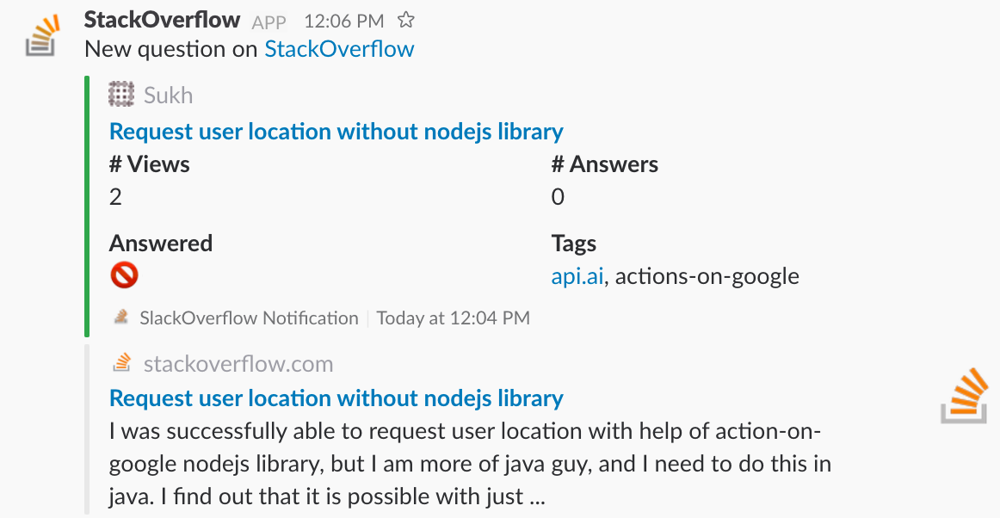

# Stack Overflow Monitor

Monitor Stack Overflow questions and post them in a Slack channel.

## Pre-requisites
- AWS account with [AWS-CLI](https://aws.amazon.com/cli/) configured
- [FaunaDB](https://faunadb.com) account
- [Serverless](https://serverless.com) framework installed
- [Slack](https://slack.com) team with incoming webhook

## Tutorial

Complete tutorial could be found [here](https://medium.com/@picsoung/monitor-stack-overflow-activity-directly-into-slack-dc778913490f)

## How to use it
in `serverless.yml` change the environment variables to your own values.

`FAUNADB_SECRET` to FaunaDB secret.

`STACK_EXCHANGE_KEY` to API key to access Stack Exchange API

`SLACK_WEBHOOK_URL` is the URL of the Slack incoming webhook you’ve created 

`SLACK_CHANNEL` should be an existing channel name in your Slack team (#support, #stackoverflow,…)

`SEARCH_KEYWORD` is the keyword you are interested to monitor (nodejs, angular2,…)

### test locally
`serverless invoke local — function getStackOverflowQuestions`

### deploy
`serveless deploy`

## Contribute
This project is open source, and we welcome anybody who wants to participate and contribute!

## License
The MIT License (MIT)
